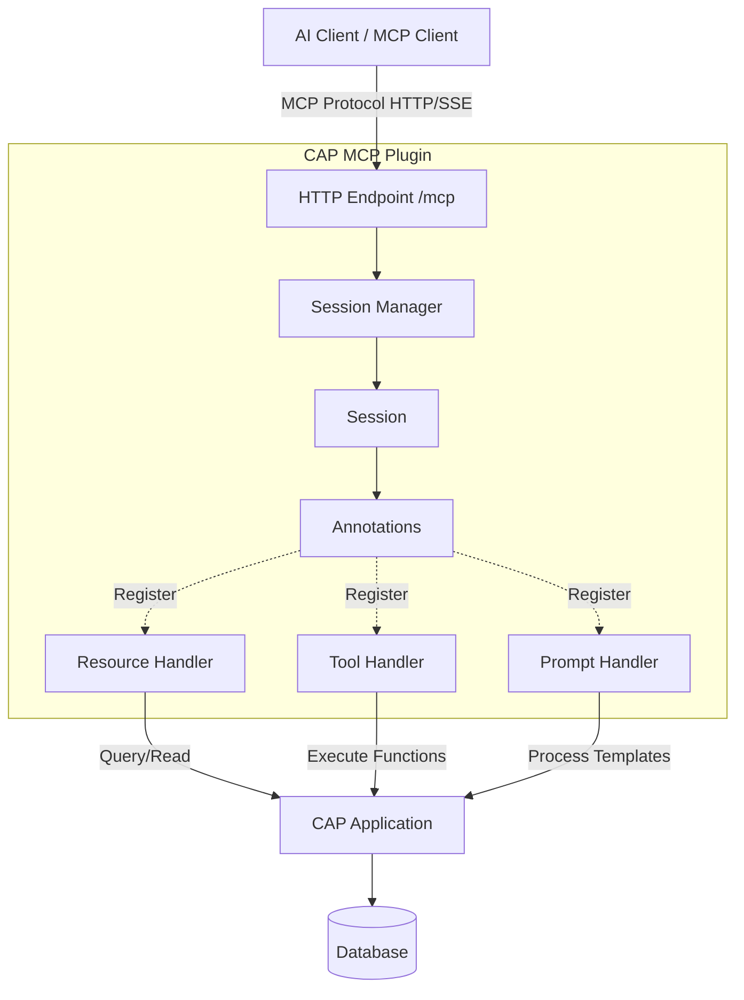

# System Architecture

Understanding the CAP MCP Plugin's architecture and how components work together.

## High-Level Architecture



## Architecture Layers

### 1. Client Layer

**MCP Clients** connect to the plugin:
- Claude Desktop
- Claude Code
- Custom MCP clients
- Any application supporting MCP

**Transport**: HTTP with Server-Sent Events (SSE) for streaming

### 2. Plugin Layer

The CAP MCP Plugin consists of several key components:

#### HTTP Endpoint (`/mcp`)
- Handles MCP protocol requests
- Manages HTTP/SSE transport
- Routes requests to appropriate handlers

**Location**: `src/mcp.ts` (main plugin class)

#### Session Manager
- Creates unique session per client
- Maintains session state
- Handles session lifecycle (create, use, cleanup)

**Session Storage**: In-memory Map with UUID keys

#### MCP Factory
- Creates MCP server instances
- Configures server capabilities
- Registers resources, tools, and prompts

**Configuration**: From `package.json` cds.mcp section

#### Annotation Parser
- Scans CSN model for `@mcp` annotations
- Parses annotation values
- Builds annotation map

**Location**: `src/annotations/parser.ts`

#### Annotation Validator
- Validates annotation schema
- Checks required properties
- Ensures type correctness

**Location**: `src/annotations/utils.ts`

#### Resource Handler
- Handles MCP resource requests
- Translates to CAP queries
- Processes OData parameters

**Location**: `src/mcp/resources.ts`

#### Tool Handler
- Handles MCP tool calls
- Routes to CAP functions/actions
- Manages parameters and returns

**Location**: `src/mcp/tools.ts`

#### Prompt Handler
- Handles MCP prompt requests
- Performs template substitution
- Returns formatted prompts

**Location**: `src/mcp/prompts.ts`

### 3. CAP Layer

Standard CAP application components:
- **Services**: Business logic and data access
- **Entities**: Data models
- **Functions/Actions**: Callable operations
- **Authorization**: Security rules

The plugin integrates seamlessly with existing CAP apps.

### 4. Data Layer

Any CAP-supported database:
- SQLite (development)
- SAP HANA (production)
- PostgreSQL
- H2

## Component Details

### Annotation System

```
CSN Model (from CDS)
        ↓
Annotation Parser
        ↓
ParsedAnnotations Map
        ↓
Annotation Validator
        ↓
Valid MCP Configuration
```

**Key Files**:
- `src/annotations/parser.ts` - Main parser
- `src/annotations/structures.ts` - Annotation classes
- `src/annotations/utils.ts` - Validation utilities
- `src/annotations/types.ts` - TypeScript types

### MCP Server Instance

Each client connection gets its own MCP server instance:

```javascript
const server = new Server({
  name: config.name,
  version: config.version
}, {
  capabilities: {
    resources: { listChanged: true },
    tools: { listChanged: true },
    prompts: { listChanged: true }
  }
});
```

**Handlers Registered**:
- `resources/list` - List available resources
- `resources/read` - Read resource data
- `tools/list` - List available tools
- `tools/call` - Execute a tool
- `prompts/list` - List available prompts
- `prompts/get` - Get a prompt template

### Type Conversion

The plugin converts between CDS and MCP types:

| CDS Type | Zod Schema | MCP Type |
|----------|------------|----------|
| String | z.string() | string |
| Integer | z.number().int() | number |
| Boolean | z.boolean() | boolean |
| Decimal | z.number() | number |
| Date | z.string() | string (ISO) |
| DateTime | z.string() | string (ISO) |
| Array | z.array() | array |

**Location**: `src/mcp/utils.ts` - Type conversion functions

## Configuration Flow

```
package.json (cds.mcp)
        ↓
Configuration Loader
        ↓
Merge with Defaults
        ↓
Plugin Configuration
        ↓
MCP Server Setup
```

**Configuration Sources**:
1. `package.json` - User configuration
2. Environment variables - Runtime overrides
3. Defaults - Built-in defaults

**Location**: `src/config/loader.ts`

## Request Flow

See [Data Flow](core-concepts/data-flow.md) for detailed request/response flow diagrams.

## File Structure

```
cap-mcp/
├── cds-plugin.js              # CAP plugin entry point
├── src/
│   ├── mcp.ts                 # Main plugin class
│   ├── annotations/           # Annotation system
│   │   ├── parser.ts          # Scans and parses @mcp
│   │   ├── structures.ts      # Annotation classes
│   │   ├── utils.ts           # Validation utilities
│   │   ├── types.ts           # TypeScript types
│   │   └── constants.ts       # Annotation constants
│   ├── mcp/                   # MCP implementation
│   │   ├── factory.ts         # MCP server factory
│   │   ├── resources.ts       # Resource handlers
│   │   ├── tools.ts           # Tool handlers
│   │   ├── prompts.ts         # Prompt handlers
│   │   └── utils.ts           # Helper functions
│   └── config/                # Configuration
│       ├── loader.ts          # Config loader
│       └── types.ts           # Config types
└── lib/                       # Compiled JavaScript
```

## Key Design Decisions

### 1. Annotation-Based Configuration

**Why**: Keeps MCP configuration close to entity/function definitions
**Benefit**: Easy to understand and maintain

### 2. Session Per Client

**Why**: Isolates client state and server instances
**Benefit**: Concurrent clients don't interfere

### 3. CAP Service Inheritance

**Why**: Leverage existing CAP security and data access
**Benefit**: No duplication of business logic

### 4. HTTP Transport

**Why**: Standard web protocol, firewall-friendly
**Benefit**: Works anywhere HTTP works

### 5. Zod for Validation

**Why**: Runtime type validation for MCP parameters
**Benefit**: Type-safe tool execution

## Performance Considerations

- **Session Map**: In-memory, scales with concurrent clients
- **Annotation Parsing**: Once at startup
- **Query Execution**: Delegated to CAP/database
- **No Caching**: Relies on CAP and database caching

## Security Architecture

- **Authentication**: Inherited from CAP
- **Authorization**: CAP's `@restrict` annotations
- **Data Privacy**: `@mcp.omit` plus CAP annotations
- **Transport Security**: HTTPS in production

## Extensibility

The plugin is designed for extensibility:

- **Custom Handlers**: Add new MCP capabilities
- **Middleware**: Inject custom Express middleware
- **Custom Types**: Extend type conversion
- **Custom Validation**: Add annotation validators

## Related Topics

- [Data Flow →](core-concepts/data-flow.md) - Request/response flow
- [CAP Integration →](core-concepts/cap-integration.md) - How the plugin integrates with CAP
- [Configuration →](guide/configuration.md) - Plugin configuration
- [Annotations →](guide/annotations.md) - Complete annotation guide
