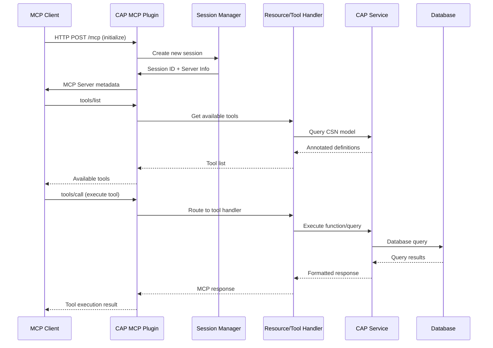
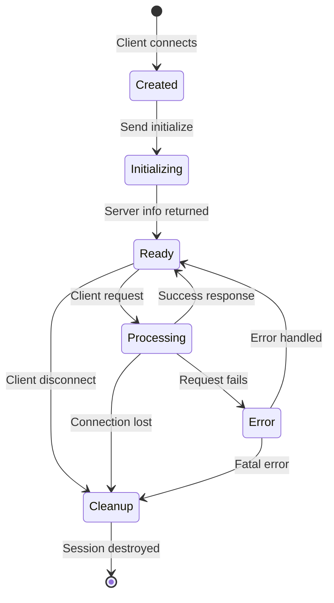

# Data Flow

Understanding how requests and responses flow through the CAP MCP Plugin.

## Request/Response Flow



## Detailed Flow Breakdown

### 1. Client Connection

**Step 1**: Client initiates connection
```http
POST /mcp HTTP/1.1
Content-Type: application/json

{
  "jsonrpc": "2.0",
  "id": 1,
  "method": "initialize"
}
```

**Step 2**: Plugin creates session
- Generates unique session UUID
- Creates new MCP server instance
- Stores in session map

**Step 3**: Returns server information
```json
{
  "jsonrpc": "2.0",
  "id": 1,
  "result": {
    "protocolVersion": "1.0.0",
    "serverInfo": {
      "name": "my-mcp-server",
      "version": "1.0.0"
    },
    "capabilities": {
      "resources": { "listChanged": true },
      "tools": { "listChanged": true }
    }
  }
}
```

### 2. Resource Query Flow

**Request**:
```json
{
  "method": "resources/read",
  "params": {
    "uri": "books?$filter=stock gt 10&$top=5"
  }
}
```

**Processing**:
1. **Parse URI**: Extract resource name and OData parameters
2. **Find Service**: Locate CAP service for resource
3. **Build Query**: Convert OData to CQN (CAP Query Notation)
4. **Execute**: Run query with CAP authorization
5. **Format**: Convert results to MCP format
6. **Return**: Send to client

**Query Translation**:
```javascript
// OData: $filter=stock gt 10&$top=5
// Becomes CQN:
SELECT.from('Books')
  .where('stock', '>', 10)
  .limit(5)
```

**Response**:
```json
{
  "jsonrpc": "2.0",
  "id": 2,
  "result": {
    "contents": [
      {
        "uri": "books",
        "mimeType": "application/json",
        "text": "[{\"ID\":1,\"title\":\"...\"}]"
      }
    ]
  }
}
```

### 3. Tool Execution Flow

**Request**:
```json
{
  "method": "tools/call",
  "params": {
    "name": "get-recommendations",
    "arguments": {
      "genre": "SCIFI",
      "limit": 5
    }
  }
}
```

**Processing**:
1. **Find Tool**: Look up tool definition
2. **Validate Parameters**: Check against Zod schema
3. **Find Service**: Locate CAP service
4. **Execute**: Call CAP function/action
5. **Handle Result**: Process return value
6. **Format**: Convert to MCP format
7. **Return**: Send to client

**CAP Execution**:
```javascript
// MCP tool call becomes:
const result = await srv.send('getRecommendations', {
  genre: 'SCIFI',
  limit: 5
});
```

**Response**:
```json
{
  "jsonrpc": "2.0",
  "id": 3,
  "result": {
    "content": [
      {
        "type": "text",
        "text": "[\"Foundation\",\"Dune\",...]"
      }
    ]
  }
}
```

### 4. Prompt Flow

**Request**:
```json
{
  "method": "prompts/get",
  "params": {
    "name": "summarize-book",
    "arguments": {
      "title": "Foundation"
    }
  }
}
```

**Processing**:
1. **Find Template**: Look up prompt definition
2. **Substitute Variables**: Replace `{{title}}` with "Foundation"
3. **Format**: Create prompt with role
4. **Return**: Send to client

**Response**:
```json
{
  "jsonrpc": "2.0",
  "id": 4,
  "result": {
    "description": "Generate book summary",
    "messages": [
      {
        "role": "user",
        "content": {
          "type": "text",
          "text": "Summarize the book: Foundation"
        }
      }
    ]
  }
}
```

## Session Lifecycle



### Session States

**Created**
- Session UUID generated
- Entry added to session map
- MCP server instance created

**Initializing**
- Client sends initialize request
- Server returns capabilities
- Handshake complete

**Ready**
- Session active and idle
- Waiting for requests
- Can process any MCP method

**Processing**
- Handling active request
- May be querying database
- May be executing function

**Error**
- Request failed
- Error logged
- Returns error to client
- Returns to Ready (recoverable) or Cleanup (fatal)

**Cleanup**
- Removes from session map
- Closes transport connection
- Frees resources

## Error Handling Flow

### Validation Errors

```
Client Request
     ↓
Parameter Validation (Zod)
     ↓ (invalid)
Error Response
     ↓
Client (with error details)
```

**Example Error**:
```json
{
  "jsonrpc": "2.0",
  "id": 5,
  "error": {
    "code": -32602,
    "message": "Invalid params",
    "data": {
      "issues": [
        {
          "path": ["limit"],
          "message": "Expected number, received string"
        }
      ]
    }
  }
}
```

### Service Errors

```
Client Request
     ↓
CAP Service Call
     ↓ (error)
CAP Error Handler
     ↓
MCP Error Format
     ↓
Client (with error details)
```

**Example Error**:
```json
{
  "jsonrpc": "2.0",
  "id": 6,
  "error": {
    "code": -32000,
    "message": "Service error",
    "data": {
      "code": "404",
      "message": "Entity 'Books' not found"
    }
  }
}
```

## Authentication Flow

See the [Authentication Flow diagram](guide/authentication.md#authentication-flow) for details on how authentication works.

## OData Parameter Processing

```
MCP Resource URI
     ↓
Parse OData Parameters
     ↓
┌────────────────────────┐
│ $filter → WHERE clause │
│ $orderby → ORDER BY    │
│ $select → Column list  │
│ $top → LIMIT           │
│ $skip → OFFSET         │
└────────────────────────┘
     ↓
Build CQN Query
     ↓
Execute in CAP
     ↓
Return Results
```

**Example Translation**:
```
Input:  books?$filter=stock gt 10&$orderby=title&$top=5
Output: SELECT.from('Books')
          .where('stock', '>', 10)
          .orderBy('title')
          .limit(5)
```

## Data Transformation

### Request → CAP

```javascript
// MCP Resource Read
{
  uri: "books?$filter=price lt 20"
}

// Becomes CAP Query
SELECT.from('Books').where('price', '<', 20)
```

### CAP → Response

```javascript
// CAP Results
[
  { ID: 1, title: "Book 1", price: 15.99 },
  { ID: 2, title: "Book 2", price: 19.99 }
]

// Becomes MCP Response
{
  contents: [{
    uri: "books",
    mimeType: "application/json",
    text: JSON.stringify(results)
  }]
}
```

## Performance Characteristics

- **Session Creation**: O(1) - map insertion
- **Annotation Lookup**: O(1) - map lookup
- **Query Execution**: Depends on CAP/database
- **Result Formatting**: O(n) - result set size

## Debugging Data Flow

Enable debug logging:

```json
{
  "cds": {
    "log": {
      "levels": {
        "mcp": "debug"
      }
    }
  }
}
```

**Log Output**:
```
[mcp] - Session created: abc-123
[mcp] - Resource query: books with filter stock gt 10
[mcp] - CAP query executed in 45ms
[mcp] - Returned 15 results
```

## Related Topics

- [Architecture →](core-concepts/architecture.md) - System components
- [CAP Integration →](core-concepts/cap-integration.md) - How the plugin integrates with CAP
- [Resources →](guide/resources.md) - Resource annotations
- [Tools →](guide/tools.md) - Tool annotations
