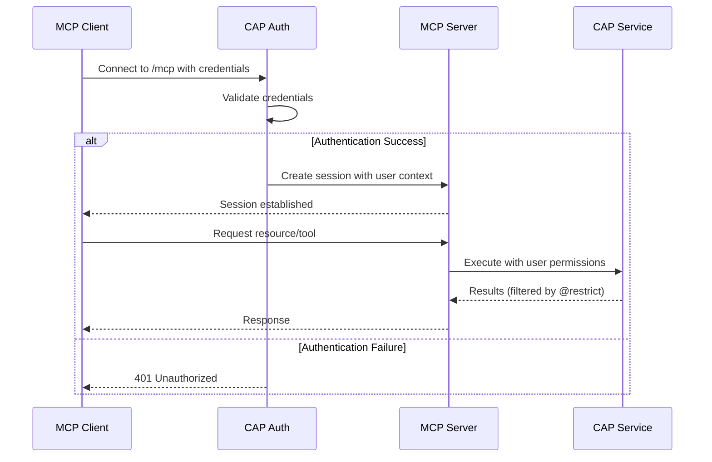
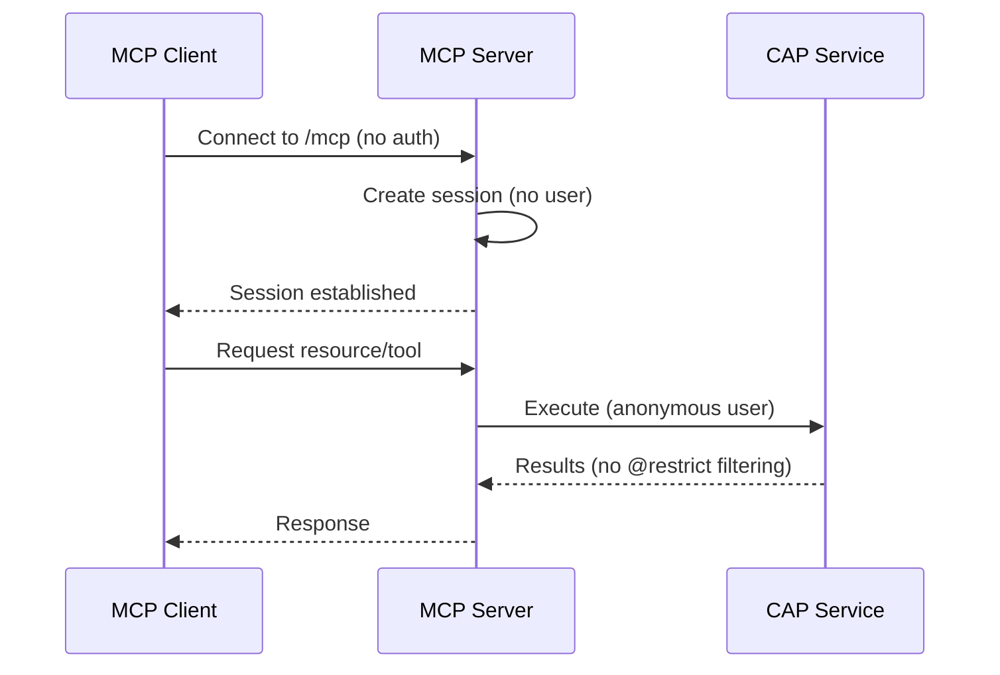
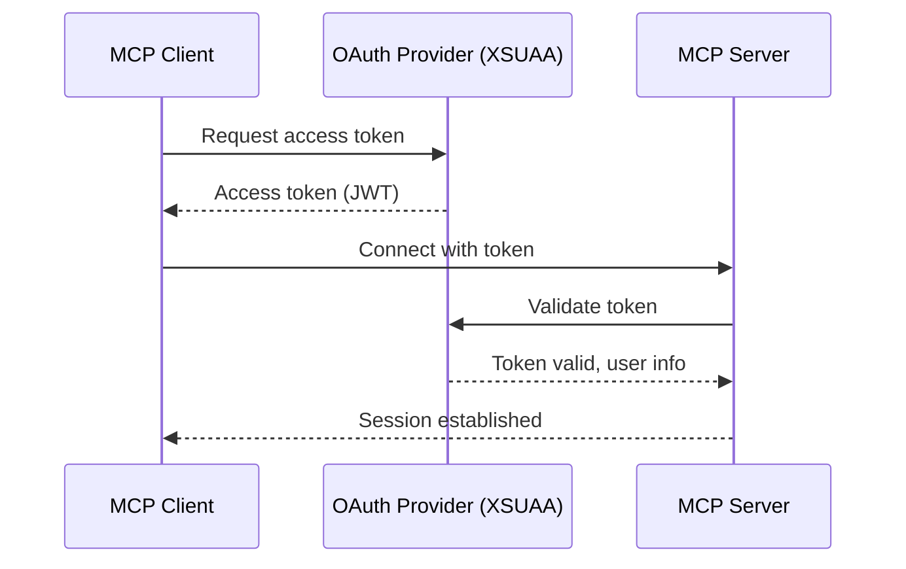
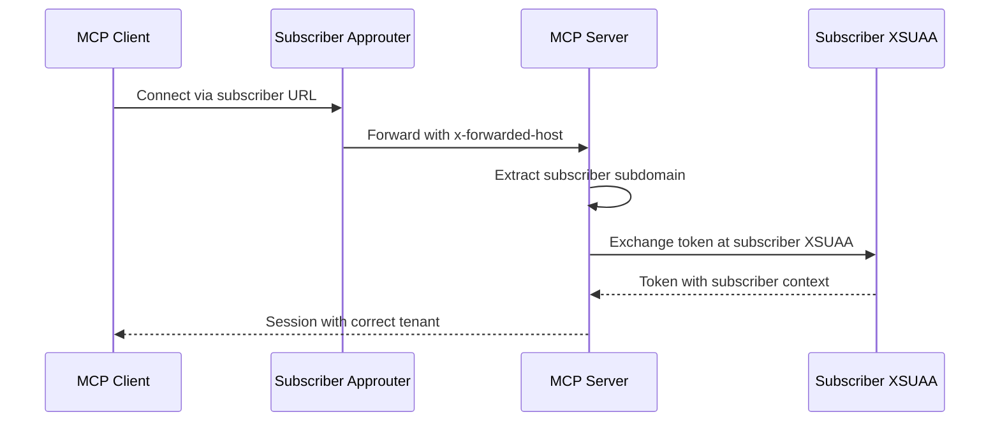

# Authentication

Configure authentication for your MCP server to secure access and leverage CAP's authentication system.

## Authentication Modes

The plugin supports two authentication modes configured via the `auth` property:

| Mode | Description | Use Case |
|------|-------------|----------|
| `"inherit"` | Use CAP's authentication | Production, secured environments |
| `"none"` | No authentication | Development, testing, local demos |

## Inherit Mode (Default)

Uses your CAP application's existing authentication system.

### Configuration

```json
{
  "cds": {
    "mcp": {
      "auth": "inherit"
    },
    "requires": {
      "auth": {
        "kind": "xsuaa"
      }
    }
  }
}
```

**Result**: MCP endpoint inherits CAP authentication - clients must authenticate.

### How It Works

1. **MCP Client Connects**: Client initiates connection to `/mcp` endpoint
2. **Authentication Check**: CAP authentication middleware validates credentials
3. **Session Creation**: If authenticated, MCP session is established with user context
4. **Inherited Permissions**: All MCP operations inherit the authenticated user's CAP permissions

**User context flows through**:
- Resource queries run as authenticated user
- Tool executions run as authenticated user
- CAP `@restrict` annotations apply
- CAP audit logging captures user identity

### Supported Authentication Methods

The plugin works with any CAP-supported authentication:

#### XSUAA (SAP BTP)

```json
{
  "cds": {
    "requires": {
      "auth": {
        "kind": "xsuaa"
      }
    }
  }
}
```

Learn more: [CAP XSUAA Authentication](https://cap.cloud.sap/docs/guides/security/authentication#xsuaa)

#### OAuth 2.0

```json
{
  "cds": {
    "requires": {
      "auth": {
        "kind": "oauth2",
        "strategy": "JWT"
      }
    }
  }
}
```

**OAuth Flow**:
1. Client obtains OAuth token
2. Client includes token in MCP requests
3. CAP validates token
4. MCP session established

#### Basic Authentication

```json
{
  "cds": {
    "requires": {
      "auth": {
        "kind": "basic-auth",
        "users": {
          "admin": "password123"
        }
      }
    }
  }
}
```

⚠️ **Warning**: Only use basic auth for development. Never in production.

#### Custom Authentication

Use CAP middleware for custom auth:

```javascript
// srv/server.js
const cds = require('@sap/cds');

cds.on('bootstrap', app => {
  // Custom authentication middleware
  app.use('/mcp', (req, res, next) => {
    const apiKey = req.headers['x-api-key'];
    if (!apiKey || !isValidApiKey(apiKey)) {
      return res.status(401).json({ error: 'Unauthorized' });
    }
    req.user = getUserFromApiKey(apiKey);
    next();
  });
});
```

## None Mode (Development Only)

Disables all authentication for local development and testing.

### Configuration

```json
{
  "cds": {
    "mcp": {
      "auth": "none"
    }
  }
}
```

**Result**: MCP endpoint is publicly accessible - **no authentication required**.

### ⚠️ Security Warning

**Never use `"none"` mode in production environments.**

**Risks**:
- Anyone can access your MCP server
- No user identity for audit logs
- CAP authorization bypassed
- Data privacy controls ineffective

**Acceptable use cases**:
- Local development
- Automated testing
- Proof-of-concept demos
- Internal development networks

### Development Best Practice

Use profiles to prevent accidental production deployment:

```json
{
  "cds": {
    "mcp": {
      "auth": "inherit"
    },
    "[development]": {
      "mcp": {
        "auth": "none"
      }
    }
  }
}
```

**Result**: Defaults to `"inherit"`, only uses `"none"` when explicitly in development profile.

Start with profile:
```bash
cds serve --profile development
```

Learn more: [CAP Profiles](https://cap.cloud.sap/docs/node.js/cds-env#profiles)

## Authentication Flow

### Inherit Mode Flow



### None Mode Flow



## Combining Authentication with Authorization

Authentication (who you are) works with CAP authorization (what you can do):

### Entity-Level Authorization

```cds
@restrict: [
  { grant: 'READ', to: 'Viewer' },
  { grant: ['READ', 'WRITE'], to: 'Admin' }
]
entity Books as projection on my.Books;
```

**With `auth: "inherit"`**:
- Viewer role users: Can query/get books via MCP
- Admin role users: Can query/get/create/update books via MCP
- Unauthenticated users: Rejected at authentication layer

Learn more: [CAP Authorization](https://cap.cloud.sap/docs/guides/security/authorization)

### Field-Level Privacy

Combine authentication with `@mcp.omit`:

```cds
entity Books {
  key ID            : Integer;
      title         : String;
      publicPrice   : Decimal;
      costPrice     : Decimal @mcp.omit;  // Hidden even from authenticated users
}
```

**Result**: Authenticated users see books but never see `costPrice` via MCP.

See [Data Privacy Guide](guide/data-privacy.md) for more.

### Tool-Level Access

Control who can execute tools:

```cds
service AdminService @(requires: 'admin') {

  @mcp: {
    name: 'delete-book',
    description: 'Delete a book from catalog',
    tool: true
  }
  function deleteBook(bookId: Integer) returns Boolean;
}
```

**Result**: Only users with `admin` role can execute `delete-book` tool.

## Testing Authentication

### Test Inherit Mode

**With valid credentials**:
```bash
curl -u user:password http://localhost:4004/mcp/health
```

**Expected**: 200 OK with server info

**Without credentials**:
```bash
curl http://localhost:4004/mcp/health
```

**Expected**: 401 Unauthorized

### Test None Mode

```bash
curl http://localhost:4004/mcp/health
```

**Expected**: 200 OK (no credentials needed)

### Use MCP Inspector

The MCP Inspector respects authentication:

```bash
npm run inspect
```

**Inherit mode**:
1. Inspector prompts for credentials (if OAuth)
2. Or manually add auth headers
3. Connect to `http://localhost:4004/mcp`

**None mode**:
1. No authentication prompts
2. Direct connection to `http://localhost:4004/mcp`

## OAuth 2.0 Example

Complete OAuth setup with XSUAA:

### 1. Configure CAP

```json
{
  "cds": {
    "mcp": {
      "auth": "inherit"
    },
    "requires": {
      "auth": {
        "kind": "xsuaa",
        "credentials": {
          "xsappname": "bookshop-app",
          "tenant-mode": "shared"
        }
      }
    }
  }
}
```

### 2. Bind XSUAA Service (BTP)

```yaml
# mta.yaml or Cloud Foundry manifest
services:
  - name: bookshop-uaa
    type: xsuaa
    parameters:
      service-plan: application
      config:
        xsappname: bookshop-app
        tenant-mode: shared
        scopes:
          - name: Viewer
          - name: Admin
```

### 3. OAuth Flow



## Multi-Tenant OAuth Configuration

For multi-tenant SAP BTP applications, OAuth token exchange must occur at the **subscriber's XSUAA**, not the provider's. This is critical for:

- Correct tenant context (zid/zdn in JWT)
- Destination service lookups
- Proper authorization scopes

### How Multi-Tenant URL Resolution Works

When a subscriber accesses your application through their approuter URL (e.g., `subscriber-tenant.myapp.cfapps.eu10.hana.ondemand.com`), the plugin automatically:

1. **Extracts the subscriber subdomain** from the request host
2. **Builds the subscriber's XSUAA URL** using that subdomain
3. **Exchanges tokens at the subscriber's XSUAA** to maintain correct tenant context



### Required Environment Variables

| Variable | Description | Example |
|----------|-------------|---------|
| `appDomain` | Application domain for tenant routing | `cfapps.eu10.hana.ondemand.com` |
| `tenantSeparator` | Separator between subdomain and domain | `.` (default) |
| `XSAPPNAME` | XSUAA app name (used for subdomain stripping) | `myapp-dev!t12345` |

### Multi-Tenant Configuration Example

```json
{
  "cds": {
    "mcp": {
      "auth": "inherit"
    },
    "requires": {
      "auth": {
        "kind": "xsuaa",
        "credentials": {
          "xsappname": "myapp-dev!t12345",
          "tenant-mode": "shared"
        }
      }
    }
  }
}
```

### Multi-Tenant Troubleshooting

#### OAuth Callbacks Use Internal CF URL

**Problem**: OAuth callbacks route to internal Cloud Foundry URLs instead of the subscriber's approuter.

**Solution**: Set the `appDomain` environment variable in your MTA or manifest:

```yaml
# mta.yaml
modules:
  - name: myapp-srv
    parameters:
      env:
        appDomain: cfapps.eu10.hana.ondemand.com
```

#### Token Issued at Wrong Tenant

**Problem**: JWT contains provider's zid instead of subscriber's zid.

**Cause**: Token exchange happening at provider's XSUAA instead of subscriber's.

**Solution**: Verify the `x-forwarded-host` header is being passed by the approuter. Check logs for:
```
[MCP-TOKEN] Built subscriber XSUAA token URL
```

#### Destination Lookups Fail

**Problem**: Destination service returns 404 or "destination not found".

**Cause**: Token has wrong tenant context (zid/zdn mismatch).

**Solution**: 
1. Verify token exchange logs show correct subscriber subdomain
2. Check `zdn` claim in JWT matches subscriber's identity zone
3. Ensure destinations are configured in subscriber's subaccount

## Common Issues

### "401 Unauthorized" in Development

**Problem**: Forgot to set `auth: "none"` for local dev

**Solution**:
```json
{
  "cds": {
    "mcp": {
      "auth": "none"
    }
  }
}
```

Or use profile:
```bash
cds serve --profile development
```

### OAuth Credentials Not Working

**Problem**: Token expired or invalid

**Solution**:
1. Obtain fresh OAuth token
2. Check token expiration
3. Verify OAuth provider configuration

**Debug**:
```json
{
  "cds": {
    "log": {
      "levels": {
        "auth": "debug"
      }
    }
  }
}
```

### Authentication Works but Authorization Fails

**Problem**: User authenticated but lacks required roles

**Example**:
```
User 'john@example.com' authenticated
ERROR: User lacks required role 'admin' for tool 'delete-book'
```

**Solution**: Assign proper roles in OAuth provider or CAP configuration

## Security Best Practices

### 1. Always Use "inherit" in Production

```json
{
  "cds": {
    "mcp": {
      "auth": "inherit"  // Never "none" in production
    }
  }
}
```

### 2. Use HTTPS in Production

```javascript
// server.js
const https = require('https');
const fs = require('fs');

const options = {
  key: fs.readFileSync('private-key.pem'),
  cert: fs.readFileSync('certificate.pem')
};

https.createServer(options, app).listen(443);
```

### 3. Implement Rate Limiting

```javascript
const rateLimit = require('express-rate-limit');

const limiter = rateLimit({
  windowMs: 15 * 60 * 1000, // 15 minutes
  max: 100 // limit each IP to 100 requests per windowMs
});

app.use('/mcp', limiter);
```

### 4. Log Authentication Events

```json
{
  "cds": {
    "log": {
      "levels": {
        "auth": "info",
        "mcp": "info"
      }
    }
  }
}
```

### 5. Regular Security Audits

- Review authentication logs
- Check for failed authentication attempts
- Monitor unusual access patterns
- Update OAuth configurations regularly

## Related Topics

- [Configuration →](guide/configuration.md) - General MCP configuration
- [Entity Wrappers →](guide/entity-wrappers.md) - Secure CRUD operations
- [Data Privacy →](guide/data-privacy.md) - Field-level security
- [CAP Security Guide](https://cap.cloud.sap/docs/guides/security/) - Complete CAP security
- [CAP Authentication](https://cap.cloud.sap/docs/guides/security/authentication) - CAP auth methods
